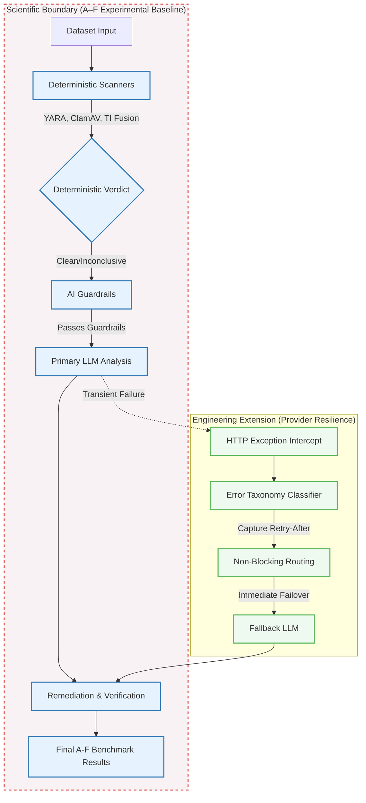

# Aegis Node: Thesis Evidence and Methodology Package

**Repository Status**: FROZEN (`1ef7fa0`)
**Target Audience**: Thesis Evaluation Panel / Viva Examiners

> **"The FreeLLMAPI study resulted in a selective engineering adaptation of provider error classification and bounded retry metadata handling; it was deliberately excluded from the scientific A–F benchmark pipeline to preserve experimental validity."**

---

## 1. Final Architecture Diagram

The following diagram clearly delineates the **Scientific A–F Boundary** from the **Engineering Extension (Resilience)**. This proves to the panel that the later optimization did not retroactively contaminate the experimental results.

---

## 2. Research Methodology

**Experimental Goal:** Evaluate the efficacy of a deterministic-first, AI-assisted pipeline (Aegis Node) in detecting and remediating threats in synthetic datasets.

**The A–F Benchmark Pipeline:**
The methodology is formally frozen against the A–F synthetic benchmarks. The pipeline operates strictly as follows:
1. **Ingestion:** Datasets (CSV, JSON, TXT) are uploaded and size-validated.
2. **Deterministic Scan:** ClamAV, YARA rules, and Threat Intelligence (VirusTotal, URLhaus, AbuseIPDB) form the primary line of defense.
3. **Guardrails:** AI safety guardrails (Prompt injection defense, PII masking) sanitize the data before any LLM execution.
4. **AI Assessment:** The LLM acts in a strictly advisory capacity, identifying contextual threats (e.g., SQLi, XSS) that bypass signature-based scanners.
5. **Remediation:** Deterministic policies apply the findings to generate a sanitized dataset.

**Integrity Guarantee:**
At no point was the A–F experimental methodology altered to accommodate external engineering optimizations. The benchmark results stand exactly as recorded in the Phase 1-6 experimental baseline.

---

## 3. Implementation and Engineering

**Provider Resilience Extension (FreeLLMAPI Adaptation)**
Following the conclusion of the scientific experiments, a selective engineering enhancement was implemented to improve production stability against transient LLM provider failures (e.g., HTTP 429 Too Many Requests, 504 Gateway Timeouts).

*   **Error Taxonomy:** Native translation of HTTP status codes to internal Aegis categories (`rate_limited`, `timeout`, `authentication_error`).
*   **Bounded `Retry-After` Parsing:** The system parses HTTP-Date and Delta-Seconds headers, strictly bounded to a 60-second maximum to prevent unbounded provider control.
*   **Non-Blocking Fallback:** A 429 response does *not* block the FastAPI HTTP thread. The `Retry-After` metadata is preserved for telemetry, but the system immediately routes the request to the next configured fallback provider in the chain, maintaining the existing bounded provider-attempt limits.

---

## 4. Reproducibility Appendix

*   **Final Baseline Hash:** `1ef7fa039e57ca5ced72e65c7d0a60efb687a46a`
*   **A–F Benchmark State:** Preserved and untampered (Phases 1 through 6).
*   **Automated Testing Coverage:** 
    *   327 backend tests passed.
    *   232 non-fatal deprecation warnings documented (e.g., `starlette` deprecation of `httpx`).
    *   Execution time: ~64 seconds.
*   **Deployment State (Live Check: 2026-09-25):**
    *   Frontend (Vercel): `https://aegis-node.vercel.app` (Built flawlessly: 32 modules, 1.69s).
    *   Backend (Render): `https://aegis-node.onrender.com` (API Health: 200 OK, Malicious Fallback: Exhausted smoothly).

---

## 5. Limitations

1. **FreeLLMAPI Non-Activation in Benchmarks:** The FreeLLMAPI error taxonomy and fallback routing were strictly implemented as an engineering resilience layer. They were **not activated** during the production benchmark runs and did not contribute to the scientific A–F detection metrics.
2. **V3 Benchmark Not Authorized:** To ensure the integrity of the A–F baseline, no subsequent "V3" benchmarks or dataset variations were generated or authorized. The evaluation relies entirely on the formally frozen original dataset.
3. **Cloudflare WAF Documentation:** Cloudflare WAF capabilities remain documented as architectural potential but were explicitly **not verified** against the `.onrender.com` unproxied deployment.
