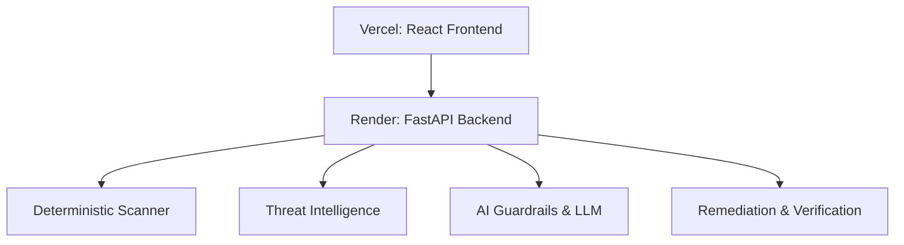
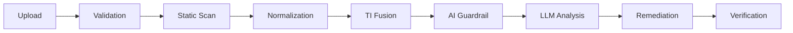
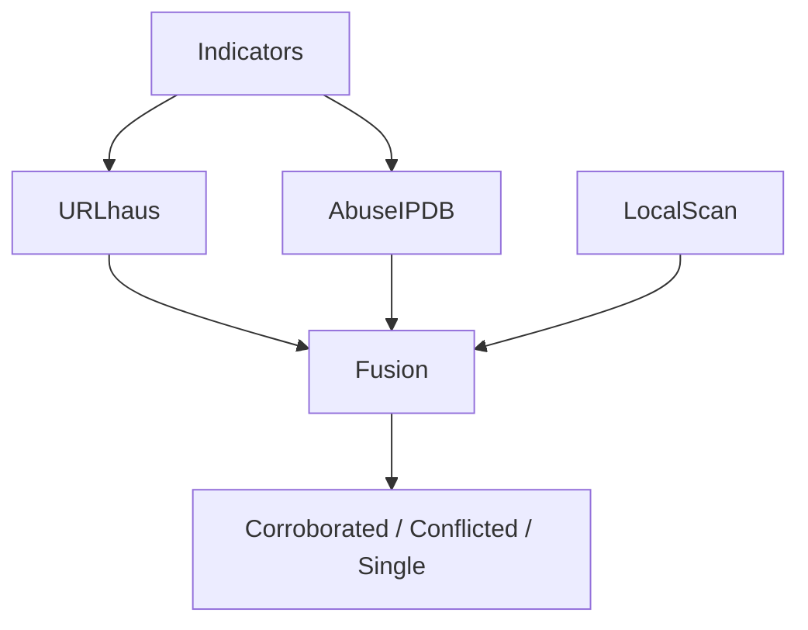
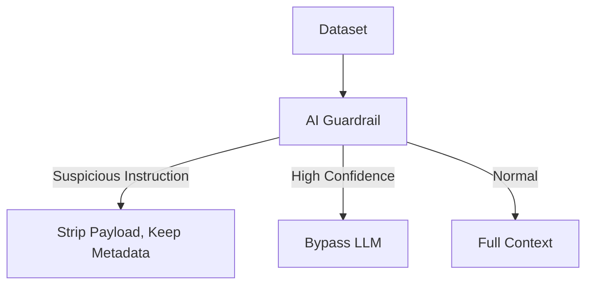
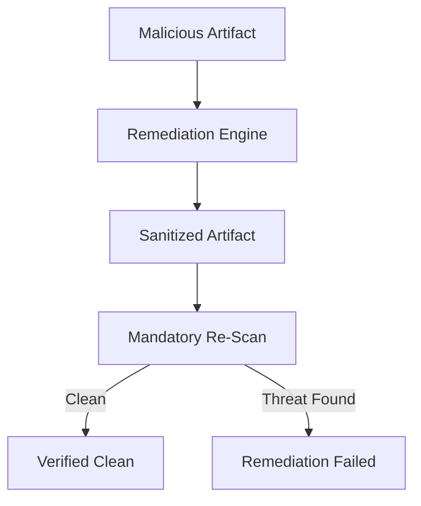

# Aegis Node Architecture Diagrams

(Note: These are Mermaid representations of the requested diagrams).

## AEGIS_NODE_ARCHITECTURE

## AEGIS_NODE_PIPELINE

## AEGIS_NODE_TI_FUSION

## AEGIS_NODE_GUARDRAIL

## AEGIS_NODE_REMEDIATION

