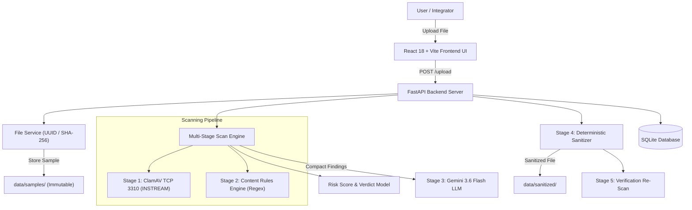
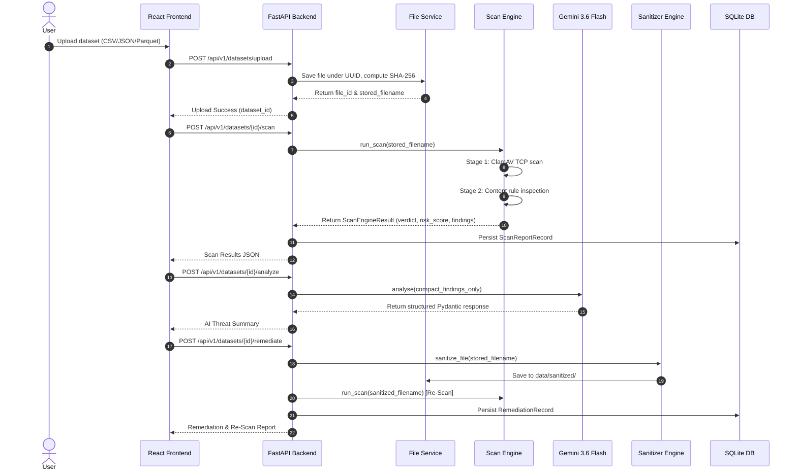
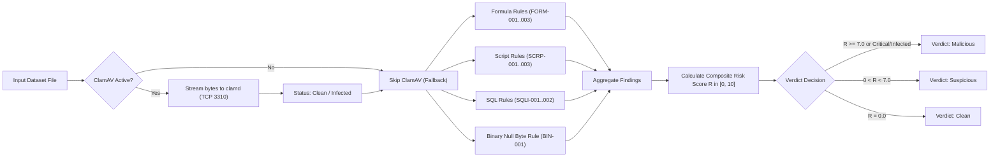
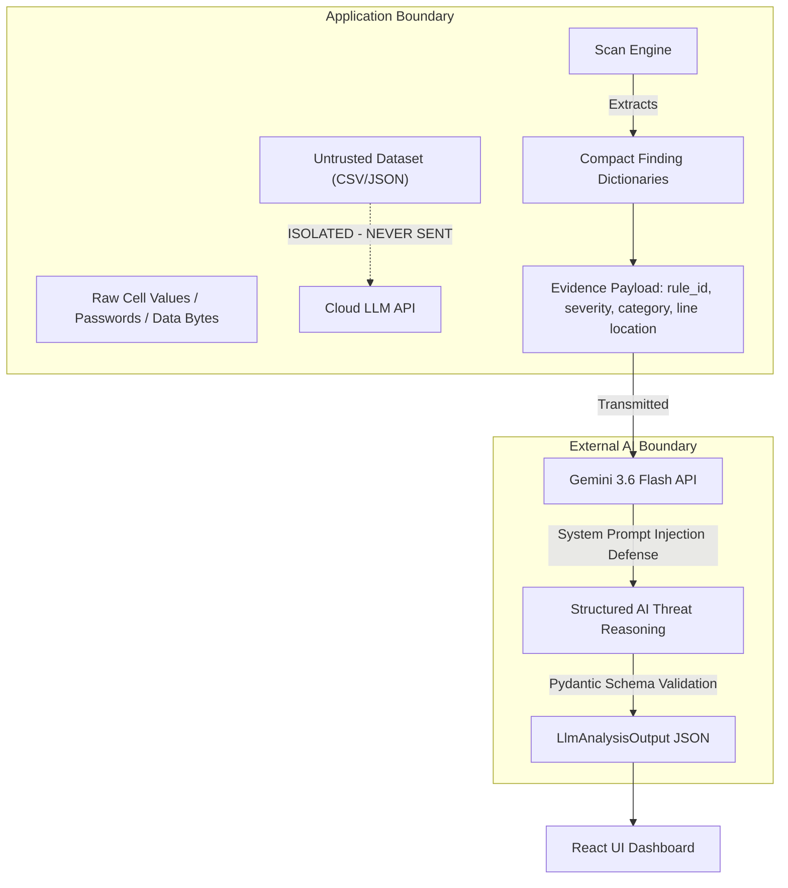
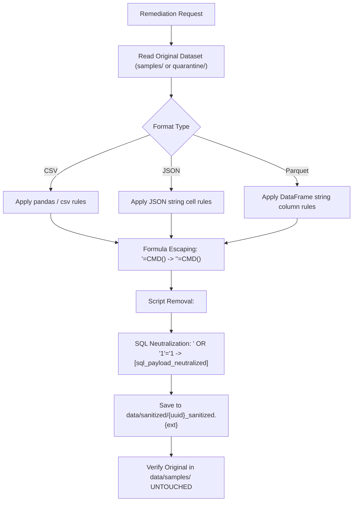
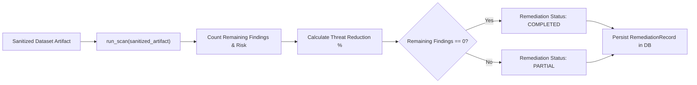
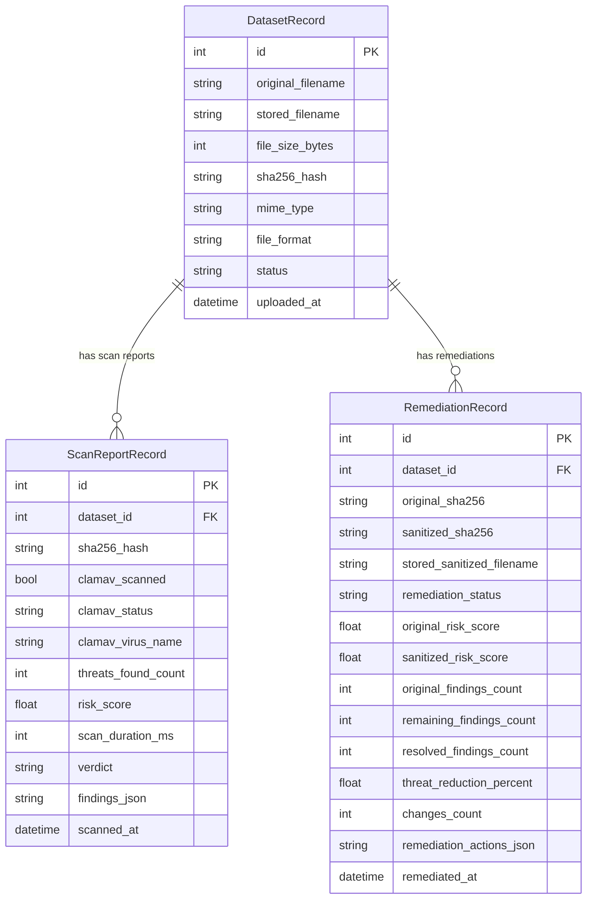
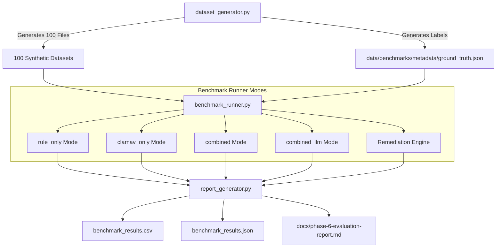

# Aegis Node — Thesis Architecture & Workflow Diagrams

This document contains official Mermaid diagrams illustrating the system architecture, data flow, detection pipeline, LLM security boundary, remediation workflow, database ER schema, and benchmark evaluation methodology for the Aegis Node M.Tech thesis.

---

## 1. System Architecture Diagram



---

## 2. Data Flow Diagram



---

## 3. Threat Detection Pipeline



---

## 4. LLM Security Boundary & Evidence Minimization



---

## 5. Remediation Pipeline



---

## 6. Re-Scan Verification Pipeline



---

## 7. Database Entity Relationship (ER Diagram)



---

## 8. Benchmark Evaluation Methodology



---

## 9. Deployment Architecture Diagram

```mermaid
graph LR
    subgraph Host OS (Windows 11 / Linux)
        subgraph Docker Engine
            ClamAVContainer["Docker Container: clamav/clamav:stable (Port 127.0.0.1:3310)"]
        end
        
        subgraph Python 3.12 Virtual Environment
            FastAPIApp["Uvicorn / FastAPI Backend Server (Port 8000)"]
        end
        
        subgraph Node.js Runtime
            ViteDev["Vite / React 18 Frontend Dashboard (Port 5173)"]
        end
        
        subgraph Local File System Storage
            SQLiteDB[("aegis_node.db")]
            SamplesDir["data/samples/"]
            QuarantineDir["data/quarantine/"]
            SanitizedDir["data/sanitized/"]
        end
    end

    ViteDev -->|REST API Requests| FastAPIApp
    FastAPIApp -->|TCP INSTREAM Socket| ClamAVContainer
    FastAPIApp --> SQLiteDB
    FastAPIApp --> SamplesDir & QuarantineDir & SanitizedDir
```
